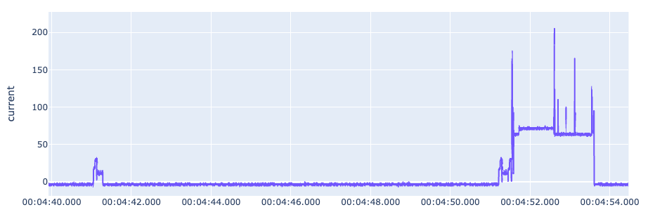

# esp8266-temperature-humidity

Mains or Battery powered IoT Temperature and Humidity sensor based on the ESP8266 chip and DHT22/Si7021 sensor.

## Prerequisites

1. An ESP8266 implementation like ESP-01, ESP-12F or NodeMCU
2. A DHT22 or Si7021 sensor
2. An MQTT server like [Mosquitto](https://mosquitto.org/)
3. 2.4GHz WiFi network with the ability to assign static IP addresses
4. Arduino IDE for flashing

## [Hardware](hardware/)

Tested on:

1. ESP-01 _lacks easy GPIO16 access for deep sleep_
2. ESP-12F **current preferred module**
3. NodeMCU _has power-hungry onboard components_

Tested with:

1. DHT22 _inefficient and low precision_
2. Si7021 **current preferred sensor**

Tested with:

1. 2xAA batteries _fine but unsustainable_
2. Nokia BL-5C Li-Ion battery **current preferred battery**

Tested with:

1. MCP1700 _fine but LDO so energy lost as heat_
2. TPS61322 **current preferred regulator**

End goal is to print the smallest PCB + battery package and 3D print a case for discrete deployment.

## [Software](software/)

Goal is to make the device last as long as possible on batteries.

Current best energy usage, using the Si7021 sensor.

**Startup:**

This includes initial connection to WiFi, sensor reading, publication, writing to RTC memory.

**Readings:**

This shows the initial reading of RTC memory, sensor measurement and back to sleep, followed by a significant change and publication.

* Worst case (a reading every 10 minutes) this should last ~3 months on a 1500mAh battery.
* Better case (heuristically [40 readings a day](analysis/temperature.ipynb)) this should last over a year on a 1500mAh battery.
