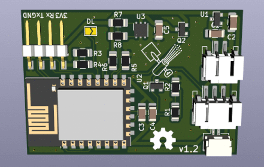

# Hardware

## Battery powered

**Goal: run for 6 months+ using a battery.**

### Batteries

Device|Min voltage (V)|Stated voltage (V)|Max voltage (V)
---|---|---|---
[ESP-12F](http://wiki.ai-thinker.com/_media/esp8266/a014ps01.pdf)|3.0|3.3|3.6
[Li-Ion Cell](https://www.amazon.co.uk/XHDATA-Rechargeable-Intelligent-Protection-Environmental-BL-5C/dp/B0796L49J1/ref=sr_1_8?)|2.8|3.7|4.2
2 X AA Alkaline|2.8|3|3.3

Two options:

1. Regulate the Li-Ion voltage to 3.3V using e.g. [MCP1700](https://www.microchip.com/wwwproducts/en/MCP1700)
2. Run off alkaline batteries without regulator (unsustainable as not rechargeable)

##### Li-Ion cells (UK)

Battery|Cost (£)|Capacity (mAh)|Unit Cost (p/mAh)|Connector
---|---|---|---|---
[BL-5C](https://www.amazon.co.uk/XHDATA-Rechargeable-Intelligent-Protection-Environmental-BL-5C/dp/B0796L49J1/ref=sr_1_4?dchild=1&keywords=bl-5c&qid=1606034143&sr=8-4)|4.49|1500|0.30|None
[MakerFocus](https://www.ebay.co.uk/itm/4pcs-3-7V-1000mAh-Lipo-Batteries-with-Micro-JST-1-25-Plug-for-Arduino-Nodemcu/402439197613?hash=item5db33ed3ad:g:UlkAAOSwowhfO4m1)|3.49|1000|0.35|JST GH 1.25
[Generic](https://www.ebay.co.uk/itm/4Packs-1800mAh-3-7V-Lipo-Battery-USB-Charger-JST-Plug-for-RC-Quadcopter-Drone-UK/402483469522?hash=item5db5e25cd2:g:l3EAAOSwB~BfgEKe)|4.75|1800|0.26|JST RCY (BEC)
**[Generic](https://www.ebay.co.uk/itm/3-7V-1200mAh-Lipo-Polymer-Rechargeable-Battery-JST-3P-PH-2-0mm-connector-603450/123751016161?hash=item1cd022a6e1:g:BV8AAOSw2zNcx6MJ)**|**2.59**|**1200**|**0.22**|**JST PH 3pin**
[Generic](https://www.ebay.co.uk/itm/3-7V-1200mAh-Lipo-rechargeable-Battery-603450-JST-1-25mm-2pin-plug-For-GPS-MP3/124254908489?hash=item1cee2b7049:g:zecAAOSwqilfCDdQ&var=425115938484)|2.00|1200|0.17|JST GH 1.25mm 2 pin
[CrazePony](https://www.amazon.co.uk/Crazepony-UK-1600mAh-battery-Connector-Quadcopter/dp/B07SPZXRWZ/ref=pd_lpo_23_t_1/261-7154536-8133442?_encoding=UTF8&pd_rd_i=B07SPZXRWZ&pd_rd_r=8bb8eb57-78a6-462a-835d-635cbd35c5ef&pd_rd_w=I1nUP&pd_rd_wg=d5kyX&pf_rd_p=7b8e3b03-1439-4489-abd4-4a138cf4eca6&pf_rd_r=214X49VS5NY38MYPG7E1&psc=1&refRID=214X49VS5NY38MYPG7E1)|5.50|1600|0.34|JST RCY (BEC)
[Adafruit LiPo](https://www.adafruit.com/product/1578)|6.00|500|1.20|JST PH
[Cool Components](https://coolcomponents.co.uk/products/lithium-polymer-battery-1000mah?_pos=7&_sid=3b7614679&_ss=r)|7.50|1000|0.75|JST PH
["LG" 18650](https://www.ebay.co.uk/itm/Genuine-LG-HG2-18650e-3000mAh-30A-3-7V-Rechargeable-Battery-With-Free-CASE/254800295445?hash=item3b5347f615:g:0f4AAOSwlIxfpa97)|5.49|3000|0.18|None - use case

##### Connectors

Connector|Spacing (mm)|Type|Cost (£)
---|---|---|---
[JST GH](https://www.aliexpress.com/item/33051405214.html?spm=2114.12057483.0.0.4016581aHOYzeO)|1.25|Right angle through hole|0.0009
JST RCY|
[JST PH 2pin](https://uk.farnell.com/jst-japan-solderless-terminals/b2b-ph-sm4-tb-lf-sn/connector-header-smt-2mm-2way/dp/9492534?MER=sy-me-pd-mi-acce)|2.0|Right angle PCB|0.45
**[JST PH 3pin](https://uk.farnell.com/jst-japan-solderless-terminals/b3b-ph-sm4-tb-lf-sn/connector-header-smt-2mm-3way/dp/9492542)**|**2.0**|**Right angle PCB**|**0.52**

### 3.3V Regulators

Regulator|Type|Quiescent Current (uA)|Vin (V)|Max current (mA)|Package
---|---|---|---|---|---
[MCP1700](https://www.microchip.com/wwwproducts/en/MCP1700)|LDO|1.6|3.6-6|250|SOT-23
[TPS62203](https://www.ti.com/product/TPS62203)|Buck|15|3.6-6|300|SOT-23

### Sensors

Sensor|Package|Power up time (ms)|Read time (ms)|Active current (mA)|Standby current (uA)|Repeatability (RH%)|Repeatability (°C)
---|---|---|---|---|---|---|---
[DHT22](https://www.sparkfun.com/datasheets/Sensors/Temperature/DHT22.pdf)|Large|N/A|2000|1.5|50|1|0.2
[Si7021](https://www.silabs.com/documents/public/data-sheets/Si7021-A20.pdf)|DFN|18|10|0.15|0.06|0.2|0.08

Compare the current usage of both sensors (the initial section is reading RTC memory):

**DHT22:**

**Si7021:**

The **Si7021** outperforms in both precision, accuracy, speed and current!

### Schematics

**Battery powered MCP1700 Si7021:**

**Mains powered DHT22:**

