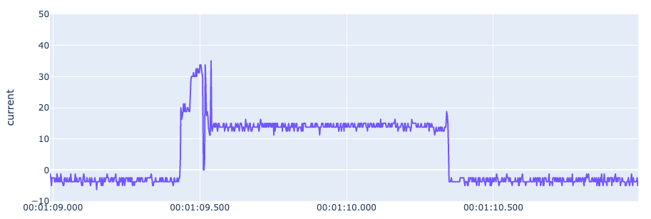
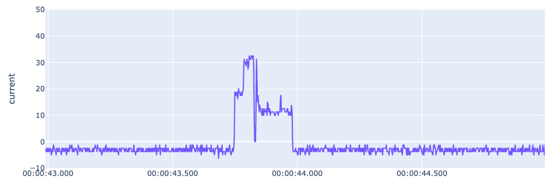
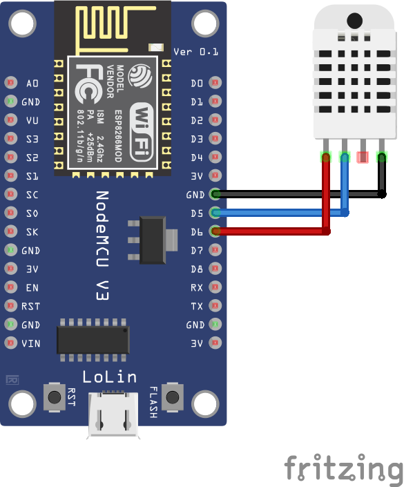

# Hardware

## Battery powered

**Goal: run for 6 months+ using a battery.**

### Batteries

Device|Min voltage (V)|Stated voltage (V)|Max voltage (V)
---|---|---|---
[ESP-12F](http://wiki.ai-thinker.com/_media/esp8266/a014ps01.pdf)|3.0|3.3|3.6
[Li-Ion Cell](https://www.amazon.co.uk/XHDATA-Rechargeable-Intelligent-Protection-Environmental-BL-5C/dp/B0796L49J1/ref=sr_1_8?)|2.8|3.7|4.2
2 X AA Alkaline|2.8|3|3.3

Two options:

1. Regulate the Li-Ion voltage to 3.3V using e.g. [MCP1700](https://www.microchip.com/wwwproducts/en/MCP1700)
2. Run off alkaline batteries without regulator (unsustainable as not rechargeable)

### Regulator

Regulator|Type|Quiescent Current (uA)|Vin (V)|Max current (mA)
---|---|---|---|---
[MCP1700](https://www.microchip.com/wwwproducts/en/MCP1700)|LDO|1.6|2.3-6|250
[TPS62203](https://www.ti.com/lit/ds/symlink/tps61322.pdf?ts=1602954670088)|Buck|6.5|0.9-5.5|1800

Tests were unable to distinguish significant difference in current usage between the regulators chosen.

### Sensors

Sensor|Package|Power up time (ms)|Read time (ms)|Active current (mA)|Standby current (uA)|Repeatability (RH%)|Repeatability (°C)
---|---|---|---|---|---|---|---
[DHT22](https://www.sparkfun.com/datasheets/Sensors/Temperature/DHT22.pdf)|Large|N/A|2000|1.5|50|1|0.2
[Si7021](https://www.silabs.com/documents/public/data-sheets/Si7021-A20.pdf)|DFN|18|10|0.15|0.06|0.2|0.08

Compare the current usage of both sensors (the initial section is reading RTC memory):

**DHT22:**

**Si7021:**

The **Si7021** outperforms in both precision, accuracy, speed and current!

### Schematics

**Mains powered DHT22:**

**Battery powered MCP1700/DHT22:**

**Battery powered TPS62203/Si7021:**

