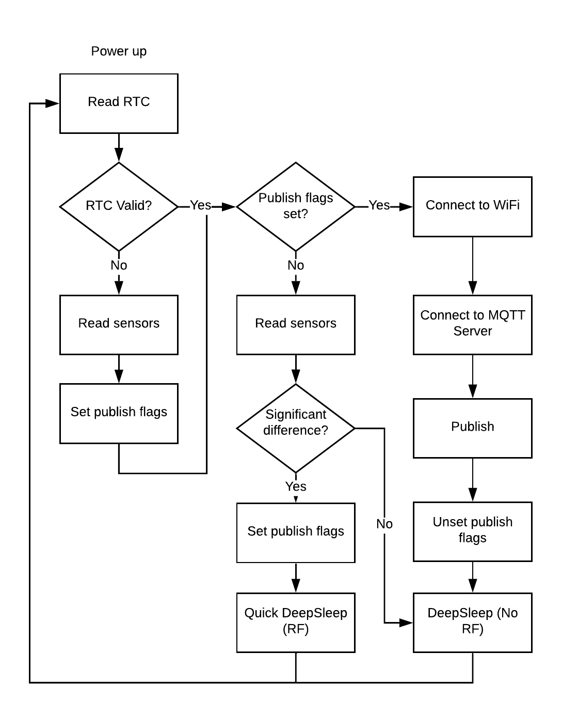

# Battery-powered sketch

Low power version based on https://www.bakke.online/index.php/2017/05/21/reducing-wifi-power-consumption-on-esp8266-part-1/ and https://blog.voneicken.com/projects/low-power-wifi-intro/.

`WAKE_RF_DEFAULT` workaround thanks to https://github.com/esp8266/Arduino/issues/3072#issuecomment-288530130

Flashed using the Arduino IDE and Board Manager URL http://arduino.esp8266.com/stable/package_esp8266com_index.json with "Generic ESP8266 Module" board.

## Features

1. Uses `WAKE_RF_DISABLED` in deep sleep to shut down RF when not needed
2. Stores `BSSID` after connection to save scan time
3. Checks every X (10) minutes for change in temperature
4. If temperature change detected, checks for changes in humidity and Vcc
5. Reboots with `WAKE_RF_DEFAULT` and publishes changes

## Flowchart

